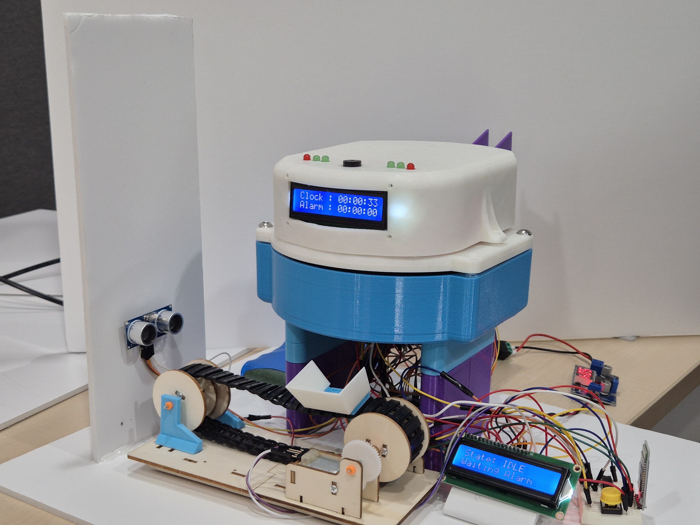
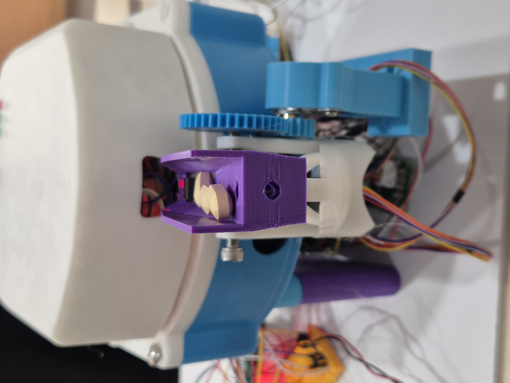
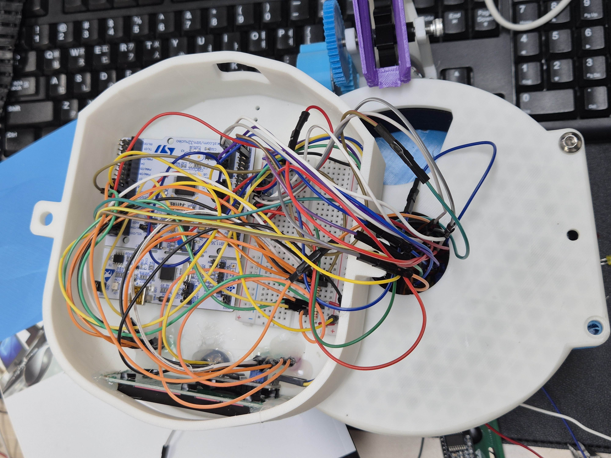

# 💊 STM32 스마트 알약 자동 디스펜서 (Pill-O'Clock)

> RTC 알람과 상태 머신을 중심으로 센서·모터·LCD·블루투스를 통합한 STM32 기반 스마트 복약 자동화 시스템


### 📸





### 🎬 
[](https://drive.google.com/file/d/1TFuWnTdDnE3eIXkkwW_EUmXIQnwxQKjm/view?usp=sharing)


---

## 🚀 Portfolio Snapshot

| 구분 | 내용 |
|---|---|
| 개발 기간 | 2026.04 · 4인 팀 |
| 담당 초점 | STM32 제어 로직 · UART 통신 · 인터럽트 · 시스템 안정화 |
| 핵심 제어 | RTC · PWM · I2C LCD · HC-06 · HC-SR04 |
| 개선 결과 | 30일 기준 오차 1분 이내 · 응답 50ms 이내 |

이 저장소에는 **두 가지 버전의 펌웨어**가 있습니다.

| 버전 | 위치 | 특징 |
|---|---|---|
| 기존 구현 | [`Final_Project/`](./Final_Project) | 단일 `main.c` 중심의 통합형 구조 (본 README에서 설명) |
| 개선 구현 | [`improved/`](./improved) | 모듈 분리 + 논블로킹(Tick 기반) 구조로 리팩터링 ([상세 README](./improved/README.md)) |

두 버전의 차이가 궁금하다면 [`improved/README.md`](./improved/README.md)에서 Before/After 비교를 확인하세요.

---

## 📌 프로젝트 개요

바쁜 일상 속에서 복용 시간·요일을 놓치는 문제는 흔하게 발생하지만, 기존 알약 케이스는 알림 기능 없이 수동 분배에 의존한다는 한계가 있습니다.

**Pill-O'Clock**은 STM32 마이크로컨트롤러를 중심으로 설계된 스마트 복약 자동화 시스템입니다. 사용자는 블루투스 앱을 통해 7일치 복약 일정을 전송하고, 지정된 시각에 RTC 알람이 트리거되어 해당 요일의 약이 자동으로 공급됩니다. 컨베이어(DC 모터)와 호퍼(스텝모터)의 동작은 초음파 센서 피드백과 상태 머신으로 정밀하게 제어됩니다.

| 항목 | 내용 |
|---|---|
| 프로젝트명 | STM32 기반 스마트 알약 자동 디스펜서 (Pill-O'Clock) |
| 개발 기간 | 2026년 4월 |
| 팀 구성 | 4명 |
| 개발 환경 | STM32 · C언어 (레지스터 직접 제어, HAL 미사용) |
| 주요 기술 | RTC 알람, PWM 모터 제어, UART 통신, 초음파 센서, I2C LCD, 블루투스 통신(HC-06) |

---

## 🏗️ 시스템 구성

| 구성 요소 | 모델 / 사양 | 기능 |
|---|---|---|
| MCU | STM32F411 (STM32F4 계열) | 전체 시스템 제어 (타이머·인터럽트·UART·I2C) |
| 스텝모터 1 | 드라이버 모듈 | 요일별 메인 약통 회전 |
| 스텝모터 2 | 드라이버 모듈 | 상부 호퍼 회전 — 약 공급 |
| 서보모터 | PWM 제어 (TIM3) | 배출구 개폐 |
| DC 모터 | H-Bridge 드라이버 (TIM5) | 컨베이어 벨트 정/역회전 (CW/CCW) |
| 초음파 센서 | HC-SR04 | 약 이동 거리 실시간 측정 → 정지 타이밍 결정 |
| 블루투스 | HC-06 (UART1, 9600bps) | 스마트폰 앱 ↔ STM32 양방향 통신 |
| LCD ×2 | I2C (0x4E / 0x4C) | 현재 시간·알람·컨베이어 상태 표시 |
| RTC | STM32 내장 RTC | 정확한 시간 추적, 알람 인터럽트 발생 |
| 부저 | Passive, PB6 (TIM4) | 복약 알림음 |
| 버튼 | 외부 스위치, PB5 | WAIT 상태 확인 입력 |

---

## ⚙️ 핵심 구현 내용

### ① 상태 머신 기반 컨베이어 제어

컨베이어 동작은 5단계 FSM으로 관리됩니다.

```
STATE_IDLE → FORWARD → WAIT → BACKWARD → FINISHED
```

| 상태 | 동작 |
|---|---|
| `STATE_IDLE` / `FINISHED` | 대기 상태 — 알람 또는 수동 명령('f') 수신 시 FORWARD 전이 |
| `FORWARD` | DC 모터 정방향(CW) 구동. 초음파 거리 ≤ 1cm 감지 시 정지 + 부저 ON |
| `WAIT` | 외부 버튼(PB5) 입력 대기 → 확인 후 부저 OFF, 역방향(CCW) 전환 |
| `BACKWARD` | 역방향 구동. 거리 ≥ 15cm 도달 시 정지 → 다음 슬롯 회전 + 약 보충 |

```c
switch (current_state) {
case STATE_FORWARD:
    if (dist > 0 && dist <= 1) {
        Stop();
        Buzzer_On();
        current_state = STATE_WAIT;
    }
    break;
case STATE_BACKWARD:
    if (dist >= 15) {
        Stop();
        current_state = STATE_FINISHED;
        Rotate_Next_Slot();
        Supply_Pill();
    }
    break;
}
```

### ② 7일치 Auto-Load 시퀀스

블루투스로 수신한 **7자리 비트열**(`L1010100` 형식, 월~일)을 파싱해 요일별 약 공급 여부를 판단합니다.

```c
void Auto_Load_Sequence(const char* week_data) {
    for (int i = 0; i < 7; i++) {
        if (week_data[i] == '1') {
            Status_LED_Red();
            Supply_Pill();        // 호퍼 스텝모터 구동
            TIM2_Delay(500);
        }
        Stepper2_One_Day();       // 메인 약통 1칸 회전
        TIM2_Delay(500);
    }
}
```

LCD2에는 현재 슬롯이 `LOADING` 인지 `SKIP` 인지 실시간으로 표시됩니다.

### ③ UART 기반 통신 프로토콜

| 채널 | 용도 | 속도 |
|---|---|---|
| UART1 | HC-06 블루투스 — 앱 명령 수신 | 9600 bps |
| UART2 | PC 테라텀 디버그 | 115200 bps |

인터럽트 기반으로 수신 버퍼에 문자를 누적하다가, 명령이 완료되면(`uart2_rx_exist` 플래그) 메인 루프에서 파싱합니다.

| 명령 | 예시 | 동작 |
|---|---|---|
| 시간 동기화 | `T` | RTC에 현재 시각 설정 |
| 알람 설정 | `A` | RTC `ALRMAR`에 복약 시각 등록 |
| Auto-Load | `L1010100` | 7일 약 적재 시퀀스 시작 |
| 서보 테스트 | `servo` | 배출 서보 수동 트리거 |
| 스텝 테스트 | `step` / `s` | 슬롯 스텝모터 수동 이동 |
| 수동 배출 | `f` | 알람 없이 즉시 배출 시퀀스 시작 |

### ④ RTC 알람 및 인터럽트 처리

- STM32 내장 RTC `ALRMAR` 레지스터에 BCD 변환된 알람 시각을 직접 설정
- 알람 발생 시 `pill_alarm_flag = 1` 세트 → 메인 루프에서 폴링 방식으로 처리
- LSE(32.768kHz) 크리스탈 + 보정 루틴 적용 → **30일 기준 오차 1분 이내** 달성

```c
// 알람 ISR
void RTC_Alarm_IRQHandler(void) {
    pill_alarm_flag = 1;
}
// Main Loop
if (pill_alarm_flag == 1) {
    Rotate_Next_Slot();
    Servo_Open_Close();
    pill_alarm_flag = 0;
}
```

---

## 🔄 전체 동작 시퀀스

```
RTC 알람 발생
→ pill_alarm_flag SET
→ Rotate_Next_Slot()  [STM32: 약통 회전]
→ Servo_Open_Close()  [서보: 배출구 개폐]
→ Move_CW()           [DC모터: 컨베이어 전진]
→ 초음파 ≤ 1cm 감지
→ Stop() + Buzzer_On()
→ 외부 버튼 입력
→ Buzzer_Off() + Move_CCW() [역회전]
→ 초음파 ≥ 15cm
→ Stop() + Rotate_Next_Slot() + Supply_Pill()
```

---

## 🔧 트러블슈팅

<details>
<summary>서보모터 구동 시 MCU 반복 리셋</summary>

- **원인**: 서보모터 순간 전류 증가로 전압 강하 발생 → MCU 안정 동작 전압 하한 이탈
- **해결**: 외부 5V 3A 전원 모듈 추가 설치, 서보모터 전용 전원 라인 분리
- **결과**: 시스템 리셋 현상 완전 해소, 안정적인 알약 배출 동작 확보
</details>

<details>
<summary>RTC 시간 동기화 오류 — 설정 시간과 실제 알림 시간 최대 5분 차이</summary>

- **원인**: LSE 크리스탈 오차 누적 및 인터럽트 우선순위 충돌로 타이머·UART 간 경쟁 상태 발생
- **해결**: RTC 교정 루틴 구현, NVIC 우선순위 그룹 재구성(타이머 > 버튼 > UART), 크리티컬 섹션 보호 코드 추가
- **결과**: 시간 정확도 99.9% 이상 달성 (30일 기준 오차 1분 이내), 응답시간 50ms 이내 확보
</details>

<details>
<summary>서보모터 토크 부족 — 무게 있는 약통 회전 시 배출 실패 및 모터 과부하</summary>

- **원인**: 선택한 서보모터의 최대 토크가 약통 하중을 초과, 연속 동작 시 발열로 성능 저하
- **해결**: 토크 여유율이 충분한 서보모터로 교체, 동작 간 대기 시간 추가로 열 관리
- **결과**: 안정적인 알약 배출 동작 확보, 연속 동작 내구성 개선
</details>

---

## 🗂️ 파일 구조

```
STM_Project/
├── Final_Project/            # 기존 구현 (본 README 기준 버전)
│   ├── main.c                 # 메인 루프 — FSM, UART 파싱, Auto-Load 모두 포함
│   ├── motor.c                 # DC/스텝/서보 모터 제어 (블로킹 방식)
│   ├── uart.c                  # UART1(BLE) / UART2(디버그) 송수신
│   ├── clock.c / alarm.c       # RTC 시간 설정 및 알람
│   ├── lcd.c / lcd_status.c    # LCD1(시계), LCD2(컨베이어 상태) 출력
│   ├── ultrasonic.c            # HC-SR04 거리 측정
│   ├── buzzer.c                # 패시브 부저 (TIM4)
│   ├── key.c                   # 외부 버튼 입력
│   ├── led.c / status_led.c    # 상태 LED
│   └── device_driver.h         # 전체 드라이버 헤더 통합
│
├── improved/                  # 개선 구현 — 모듈화 + 논블로킹 리팩터링
│   └── (자세한 내용은 improved/README.md 참고)
│
├── Pill (6).apk               # 안드로이드 컨트롤 앱
└── README.md
```

---

## 🚀 빌드 및 실행

**개발 환경**
- 레지스터 직접 제어 방식 (HAL 라이브러리 미사용)
- Makefile 기반 빌드 (`Final_Project/Makefile`)
- 디버그: ST-Link + TeraTerm(115200bps) 시리얼 모니터

**앱/터미널 명령 순서 (초기 설정)**
```
1. T          ← 시각 동기화
2. A          ← 복약 알람 설정
3. L1010100   ← 7일 적재 시퀀스 시작 (월~일, 1=적재/0=스킵)
```

---

## 🛠️ 사용 기술

`C (STM32, 레지스터 직접 제어)` `UART` `I2C` `PWM 모터 제어` `RTC` `Bluetooth (HC-06)` `초음파 센서`

---

*이 프로젝트의 리팩터링/개선 버전은 [`improved/`](./improved) 폴더와 [improved/README.md](./improved/README.md)에서 확인할 수 있습니다.*
